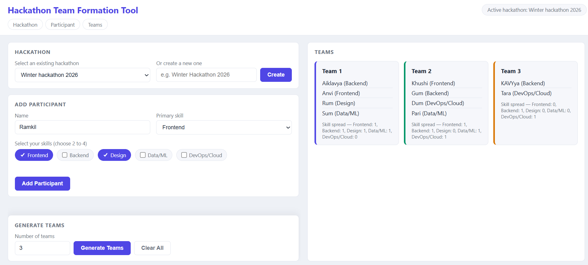
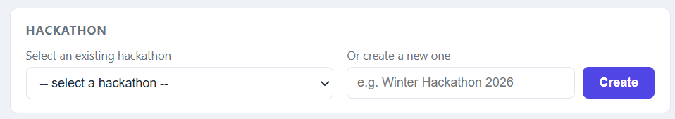
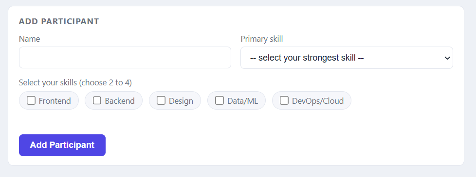
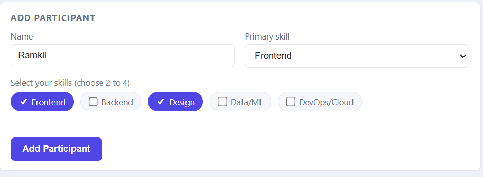
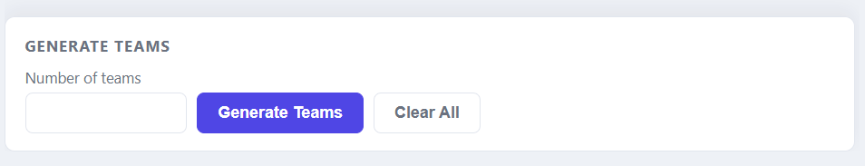
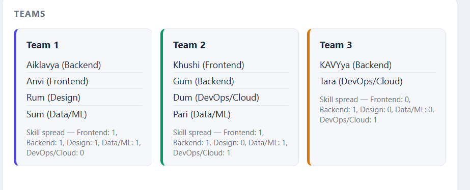

# hackathon-team-formation

A tool that automatically splits hackathon participants into balanced
teams, so each team ends up with a spread of skills (Frontend, Backend,
Design, Data/ML, DevOps/Cloud) instead of one team hoarding all the
frontend people while another has none.

This is Phase 1 of a 2-phase build: a pure vanilla JavaScript version
using the browser's LocalStorage for data, with no backend or database
yet. Phase 2 will rebuild this as a full MERN stack application.

## Features

- Create multiple hackathons and keep their participants separate
- Add participants with a validated skill-tag form (choose 2–4 skills,
  mark one as your primary skill)
- Generate N balanced teams using a greedy skill-balancing algorithm
- View results as team cards showing members and skill spread per team
- Clear participants for a specific hackathon without affecting others

## Setup / How to Run

No installation or build step is needed — this is plain HTML, CSS, and
JavaScript.

1. Clone the repository:
git clone https://github.com/shauraya15/hackathon-team-formation.git
2. Open the project folder and open index.html directly in a browser
   (double-click it, or use the VS Code "Live Server" extension for
   auto-reload while developing).
3. No server, database, or dependencies are required for Phase 1.

## Architecture / How It Works

The project is split into small, single-purpose files so each part of
the logic is easy to find, test, and explain independently:

- *index.html* — the page structure: hackathon selector, participant
  form, and results section.
- *style.css* — all visual styling.
- *js/storage.js* — the data layer. Reads and writes hackathons and
  their participants to LocalStorage. Each hackathon's participants are
  stored under their own key (participants_<hackathonId>), so
  different hackathons never mix their data.
- *js/validation.js* — checks a participant's form entry (name
  required, 2–4 skills selected, primary skill must be one of the
  selected skills) before it's saved.
- *js/balancer.js* — the core algorithm. Takes a list of participants
  and a number of teams, and distributes participants so each team gets
  an even spread of skill categories. Participants are sorted by number
  of skills (fewer first, since they're harder to place well), then each
  one is greedily assigned to whichever team currently has the fewest
  people with that participant's primary skill.
- *js/render.js* — takes the finished teams array and builds the team
  cards shown on the page. Purely visual, makes no decisions.
- *js/app.js* — the coordination layer. Listens for user actions
  (selecting/creating a hackathon, submitting the form, clicking
  Generate Teams or Clear Participants) and calls the right functions
  from the other files in the right order.

### Data flow, end to end

1. Organizer selects or creates a hackathon → sets the "active"
   hackathon in memory.
2. Student fills the form → validated → saved into that hackathon's
   participant list in LocalStorage.
3. Organizer clicks "Generate Teams" → the active hackathon's
   participants are pulled from storage and passed to the balancing
   algorithm.
4. The algorithm returns a teams array → passed to the renderer → team
   cards appear on screen.

A deliberate design choice here: balancer.js and render.js don't
know anything about LocalStorage or hackathons — they just take data in
and return/display results. This kept the algorithm and the UI
completely decoupled, which is why adding multi-hackathon support later
only required changes to storage.js and app.js, with zero changes
to the algorithm itself.

## Screenshots

### Project Overview

### Hackathon Selection

### Empty Participant Form

### Filled Participant Form

### Generate Teams

### Team Cards View

## Future Work (Phase 2)

- Participant self-registration with login/signup, instead of
  organizer-only data entry
- Role-based views: organizer dashboard vs. a participant dashboard
  showing "hackathons you're registered in"
- These require proper relational data (which user is registered to
  which hackathon) and real authentication — both natural fits for
  Phase 2's MongoDB schemas and JWT-based auth, rather than being
  simulated in LocalStorage