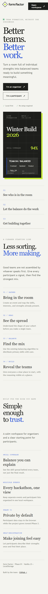
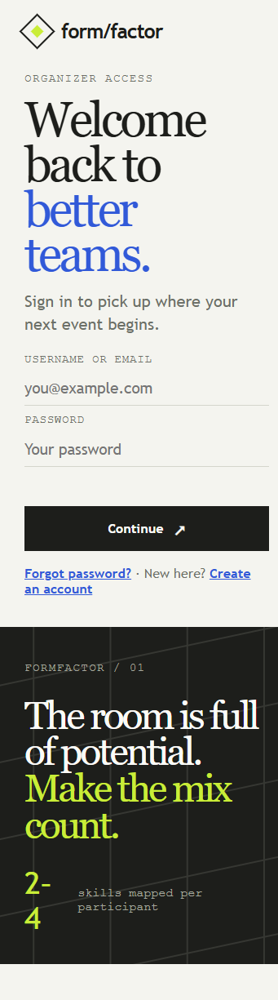
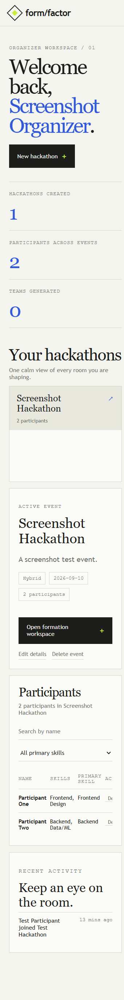
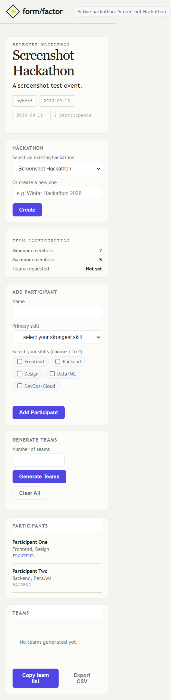

# Formfactor

Formfactor is a browser-based hackathon team formation tool. It helps organizers turn participants with different strengths into balanced teams that are ready to build.

Hackathon organizers often need to form teams quickly from a mixed group of frontend, backend, design, data, and cloud participants. Manual grouping can be slow and subjective. Formfactor collects each participant's skills and primary skill, then uses an explainable balancing algorithm to distribute people across teams.

This is **Phase 1** of the project. It uses plain HTML, CSS, and JavaScript with LocalStorage. There is no backend, database, framework, or external authentication/email service yet.

## Project Goal

The project solves the problem of unbalanced hackathon teams, where one team may collect similar skills while another team has important gaps. The application gives organizers a structured workflow and gives participants a clear view of their registration and team assignment.

## Complete User Flow

1. An organizer creates an account and signs in.
2. The organizer creates a hackathon with event details.
3. A participant creates an account and signs in.
4. The participant browses available hackathons.
5. The participant selects an event and registers with 2–4 skills and one primary skill.
6. The organizer opens the selected event's formation workspace.
7. The workspace loads the event details, participants, and any saved teams.
8. The organizer checks feasibility and generates teams.
9. The existing balancing algorithm distributes participants by primary skill.
10. Generated teams are saved in LocalStorage.
11. Participants return to their dashboard and see either `Registered — waiting for teams` or their assigned team.
12. Assigned participants can see their team number, teammates, primary skills, and skill spread.
13. The organizer can copy or export the team list and log out.

## Current Features

### Home and presentation

- Responsive product-style Home page
- Organizer and participant entry points
- How-it-works and feature sections
- Shared restrained paper, ink, blue, and lime design system
- Responsive layouts for desktop and mobile
- Purposeful hover and entrance animations
- Compact spacing for easier first-viewport navigation

### Organizer features

- Organizer signup and login
- Login with username or email
- LocalStorage session handling
- Organizer dashboard
- Hackathon statistics
- Create hackathon form with:
  - Name
  - Description
  - Start and end dates
  - Online, Offline, or Hybrid mode
  - Venue
  - Registration deadline
  - Maximum participants
- Multiple hackathons with separate participant lists
- Hackathon selection by ID
- Hackathon details in the formation workspace
- Edit hackathon name
- Delete hackathon and related local data
- Participant roster with name, skills, and primary skill
- Participant search by name
- Participant filtering by primary skill
- Participant deletion
- Formation workspace with existing configuration
- Saved team results loaded immediately when available
- Generate and regenerate teams
- Minimum and maximum team-size checks
- Team generation activity log
- Copy team list
- Export team list as CSV
- Organizer logout

### Participant features

- Participant signup and login
- Login with username or email
- Participant name, email, phone, college, year, username, password, and optional bio
- Browse all available hackathons
- View event description, dates, mode, and participant count
- Join a hackathon through a skill form
- Select 2–4 skills
- Select one primary skill
- Registration linked to the account using `participantId`
- Registration status: waiting for teams
- Assigned-team status after generation
- My Hackathons view
- Team number and teammate list
- Teammate primary skills
- Overall team skill spread
- Participant logout

### Formation workspace

The **Open Formation Workspace** action passes the selected hackathon ID in the URL:

```text
pages/organizer-tool.html?hackathon=<hackathon-id>
```

The workspace then retrieves the selected event's data from LocalStorage and displays:

- Selected hackathon details
- All registered participants
- Minimum members: 2
- Maximum members: 5
- Requested team count
- `No teams generated yet.` when no saved result exists
- Existing saved team cards when teams already exist

Each detailed team card contains:

- Team number
- Number of members
- Member names
- Member skills
- Member primary skills
- Team primary-skill distribution

## Team Algorithm

The original algorithm in `js/balancer.js` is preserved.

Its behavior is:

1. Check whether the participant count can fit within the requested number of teams.
2. Require at least 2 and at most 5 members per team.
3. Sort participants by number of selected skills.
4. Place participants greedily into the team with the lowest count for their primary skill.
5. Use team size and minimum-team constraints as placement safeguards.
6. Return team objects containing members and skill counts.

The algorithm balances by **primary skill**. Other selected skills are stored, displayed, and available for future algorithm improvements, but they do not currently change the balancing calculation.

A direct test covered 154 feasible participant/team combinations. No participant assignment, team-size, or duplicate-member failures were found.

## Screenshots

These screenshots document the current Phase 1 interface and the main presentation flow:

### Home page



### Organizer login



### Organizer dashboard



### Formation workspace



The formation workspace screenshot shows the selected hackathon, event metadata, participant roster, team configuration, and the empty state before teams are generated. After generation, the workspace displays detailed team cards and the saved-results confirmation.

## Folder Structure

```text
hackathon-team-formation/
├── pages/
│   ├── index.html
│   ├── organizer-login.html
│   ├── organizer-signup.html
│   ├── organizer-dashboard.html
│   ├── create-hackathon.html
│   ├── organizer-tool.html
│   ├── participant-login.html
│   ├── participant-signup.html
│   └── participant-dashboard.html
├── styles/
│   ├── shared.css
│   ├── auth.css
│   ├── dashboard.css
│   └── style.css
├── js/
│   ├── app.js
│   ├── balancer.js
│   ├── render.js
│   ├── storage.js
│   ├── validation.js
│   ├── auth.js
│   ├── dashboard.js
│   ├── team-state.js
│   ├── formation.js
│   └── phase2.js
├── screenshots/
├── README.md
└── .git/
```

## File Responsibilities

- `pages/index.html` — Home page
- `pages/organizer-login.html` — Organizer login
- `pages/organizer-signup.html` — Organizer account creation
- `pages/organizer-dashboard.html` — Organizer event and participant workspace
- `pages/create-hackathon.html` — Event creation form
- `pages/organizer-tool.html` — Existing participant form, team generation, saved team display, and export actions
- `pages/participant-login.html` — Participant login
- `pages/participant-signup.html` — Participant account creation
- `pages/participant-dashboard.html` — Event browsing, registration, and team status
- `styles/shared.css` — Home page design system
- `styles/auth.css` — Authentication and event-creation styles
- `styles/dashboard.css` — Dashboard and formation workspace styles
- `styles/style.css` — Original formation tool styles
- `js/storage.js` — Existing LocalStorage data layer
- `js/validation.js` — Existing participant validation
- `js/balancer.js` — Protected team-balancing algorithm
- `js/render.js` — Existing basic team-card renderer
- `js/app.js` — Existing formation workspace coordinator
- `js/auth.js` — Frontend-only signup, login, and password reset
- `js/dashboard.js` — Session checks, organizer dashboard behavior, and shared data helpers
- `js/team-state.js` — Saved team-result storage and activity helper
- `js/formation.js` — Formation workspace data and detailed-card renderer
- `js/phase2.js` — Activity, joined-hackathon, and participant skill helpers

The protected core files were not changed:

- `js/balancer.js`
- `js/app.js`
- `js/storage.js`
- `js/validation.js`
- `js/render.js`

New functionality wraps around the existing logic instead of replacing the balancing math.

## LocalStorage Data Model

Phase 1 uses these browser keys:

- `organizers`
- `participantAccounts`
- `loggedInOrganizerId`
- `loggedInParticipantId`
- `hackathons`
- `participants_<hackathonId>`
- `hackathonDetails`
- `teamResults`
- `activityLog`

This data is local to one browser origin and one device. For example, `file:///...`, `localhost`, and `127.0.0.1` have separate LocalStorage areas.

## How to Run

No installation or build step is required.

1. Open the cloned project in VS Code.
2. Start the Live Server extension from the project folder.
3. Open:

   ```text
   http://127.0.0.1:5500/hackathon-team-formation/pages/index.html
   ```

4. Use the same browser origin for every signup, login, and dashboard test.
5. Create one organizer account, one hackathon, and enough participants to satisfy the team-size rules.

## Recommended Demo Sequence

1. Open `pages/index.html`.
2. Create an organizer account.
3. Create a hackathon.
4. Log out.
5. Create a participant account.
6. Join the hackathon and select 2–4 skills.
7. Repeat with enough participants for the requested number of teams.
8. Log in as the organizer.
9. Open the hackathon dashboard.
10. Click the event arrow to inspect participants.
11. Click **Open formation workspace**.
12. Confirm the selected event details and participant roster.
13. Enter a valid team count and click **Generate Teams**.
14. Confirm team cards and the saved-results message.
15. Log in as a participant.
16. Confirm the status changes from waiting to assigned.
17. Show the participant's team, teammates, skills, and skill spread.
18. Demonstrate Copy Team List and Export CSV.

## Phase 1 Limitations

- Data is stored only in the current browser.
- Passwords are stored in LocalStorage for demonstration and are not production-secure.
- No real email is sent.
- Forgot-password updates the password locally after email verification.
- Invitations and email acceptance links are not implemented.
- No real-time synchronization exists across browsers or devices.
- Same-browser invitation simulation can be added, but real email requires a backend or email service.

## Future Phase 2

A future MERN version can add:

- Secure authentication and password hashing
- Shared database storage
- REST APIs
- Role-based access control
- Email verification and password reset
- Real invitations and acceptance links
- Cross-device access
- Notifications and real-time updates

## Project Status

**Phase 1 — Vanilla HTML, CSS, JavaScript, and LocalStorage**
